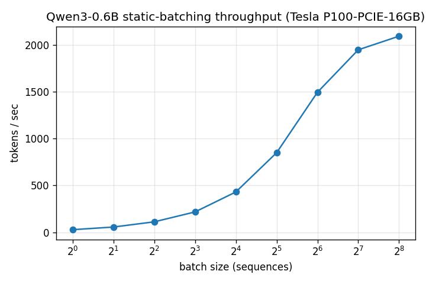

# nano-whisper-serve

A **from-scratch inference engine** that runs Whisper and serves multiple concurrent audio
streams — hand-written in plain PyTorch. No `faster-whisper`, no HuggingFace `generate()`,
no vLLM: the decode loop, KV cache, and scheduler are all written by hand, and every
optimization is explained with roofline reasoning (memory-bound vs compute-bound, arithmetic
intensity, critical batch size `B_crit`).

Existing products already do this faster; the point of this repo is a *transparent,
explainable* engine where each speedup is one commit + one measured number.

## Status

| Milestone | What | State |
|---|---|---|
| **M1 — Qwen text engine** (`playground/`) | hand-written Qwen3-0.6B forward + greedy + KV cache + static batching | ✅ done |
| M2 — Whisper core (`engine/`) | mel → encoder (once) → decode loop with two caches (static cross-attn + growing self-attn) | ✅ done |
| M3 — Serving engine (`serving/`) | continuous batching over N concurrent audio streams; RTF + throughput benchmarks | planned |
| M4 — Streaming shell (`demo/`) | WebSocket, partial transcripts, LocalAgreement token locking | planned (bonus) |

M1 is a throwaway "training wheels" sandbox: it builds the decode-loop + KV-cache machinery on
a text LLM (Qwen3-0.6B) before porting the pattern to the Whisper decoder in M2.

## Milestone 1 results — Qwen3-0.6B, plain PyTorch

**Correctness first.** The hand-written engine reproduces HuggingFace
`generate(do_sample=False)` **token-for-token** (fp32, greedy is deterministic) on every
prompt — a differential test against a reference oracle (`playground/ref_qwen.json`). No
throughput number is trusted until this gate passes.

**Optimization story** (each = one commit + one number):

| Step | Change | Number | Roofline explanation |
|---|---|---|---|
| v0.0 | naive forward + greedy, **no cache** | floor (~5.6 tok/s, CPU fp32) | recomputes the whole prefix every step → O(n²) work; deep memory-bound |
| v0.1 | **+ KV cache** (contiguous, not paged) | ~2.7× (CPU A/B, same output) | each decode step computes K/V for only the new token → single-token decode is memory-bound, arithmetic intensity ≈ 1; the cache removes the redundant prefix recompute |
| v0.1 | **+ static batching** | **27 → 2095 tok/s, ~76×** (P100) | batching amortizes one weight read across the batch → intensity rises with batch size, moving from memory-bound toward compute-bound at `B_crit` |

### The B_crit curve (throughput vs batch size, Tesla P100, fp32)



| batch | 1 | 2 | 4 | 8 | 16 | 32 | 64 | 128 | 256 |
|---|--|--|--|--|--|--|--|--|--|
| tok/s | 27 | 56 | 111 | 217 | 431 | 850 | 1496 | 1949 | 2095 |
| ms/step | 37 | 36 | 36 | 37 | 37 | 38 | 43 | 66 | 122 |

Throughput scales **~linearly up to ~batch 64** while per-step latency stays flat (~37 ms) —
the **memory-bound** regime, where adding a sequence is nearly free because the weight read is
amortized. Past ~batch 64–128 the curve **bends** and per-step latency climbs (43 → 66 → 122 ms):
the matmuls have become **compute-bound**. That knee is `B_crit`
(≈ peak_FLOP / peak_bandwidth for the GPU). Raw numbers + GPU metadata:
[`benchmarks/qwen_tokens_per_sec_vs_batch.json`](benchmarks/qwen_tokens_per_sec_vs_batch.json).

## Milestone 2 results — Whisper-small, plain PyTorch

The engine transcribes audio end-to-end — log-mel → encoder (run once) → greedy decode with two KV
caches — all hand-written. It reproduces `openai/whisper` (small, greedy, `without_timestamps`)
**token-for-token** on both a Vietnamese and an English clip.

**Correctness is gated in layers** against a reference oracle (`engine/ref_whisper.py` dumps
`openai/whisper`'s own mel, encoder output, and token stream as the answer key). Each layer must match
before the next is trusted:

| Layer | Check | Result |
|---|---|---|
| mel front-end | `max\|Δ\|` vs `whisper.log_mel_spectrogram` | **0.0** (bit-exact) |
| encoder output | `max\|Δ\|` vs `whisper` encoder | **0.0** (bit-exact) |
| transcript | token-for-token vs `whisper` greedy | **exact** (VN + EN, + 8 diverse/edge clips) |

**Optimization story** (each = one commit + one number):

| Step | Change | Number | Roofline explanation |
|---|---|---|---|
| v0.2 | naive greedy decode, **no cache** | ~14 tok/s (CPU) | recomputes the whole token prefix every step **and** re-projects cross-attention K/V from all 1500 encoder frames × 12 layers each step |
| v0.2 | **+ two KV caches** | **~2.2×** (CPU, identical output) | self-attention K/V grow one row per step; cross-attention K/V are computed **once** from the static encoder output and reused — decode stays memory-bound (arithmetic intensity ≈ 1), the caches just remove the redundant recompute |

### self-attention cache vs cross-attention cache

Whisper is encoder–decoder, so the decoder carries **two** attention caches that behave differently:

- **Self-attention cache** — identical to a decoder-only LLM (Milestone 1): it holds the K/V of the tokens
  generated so far and **grows by one entry per step** (`torch.cat` on the sequence axis). The new token's
  positional offset is the current cached length.
- **Cross-attention cache** — the decoder attends to the encoder output, which is **fixed for the whole
  30-second segment**. So its K/V are projected **once** on the first decode pass and reused unchanged for
  every later token — "prefill in disguise". The naive path re-reads 1500 encoder frames through 12 layers
  every step for nothing.

That second cache is the only structural addition over the Milestone-1 text decoder — the greedy loop, the
growing self-attention cache, and the attention/LayerNorm blocks all port directly.

### Design notes / non-goals (Milestone 2)

Greedy decoding only; one 30-second segment; language passed explicitly (no auto-detection). No word-level
timestamps (decoded with `<|notimestamps|>`), no beam search, no temperature fallback — deliberately out of
scope. The tokenizer is built on `tiktoken` alone: the engine never imports `openai-whisper`, which is used
only as the test-time reference oracle.

## Run it

```bash
python3 -m venv .venv && .venv/bin/pip install -r requirements.txt
huggingface-cli download Qwen/Qwen3-0.6B --local-dir models/qwen3-0.6b

# M1: generate + correctness check (matches the HF reference token-for-token) + naive-vs-cached A/B
.venv/bin/python playground/qwen.py

# M2: download Whisper-small, create the VN/EN fixtures, build the reference answer key
.venv/bin/python -c "import whisper; whisper.load_model('small', download_root='models/whisper-small')"
.venv/bin/python tests/fixtures/make_fixtures.py
.venv/bin/python -m engine.ref_whisper

# correctness gate (M1 token-for-token + batched; M2 mel/encoder bit-exact + transcript token-for-token)
.venv/bin/python -m pytest tests/ -q

# throughput sweep -> the B_crit curve (use a GPU for a representative curve)
.venv/bin/python benchmarks/bench_qwen.py --device cuda --batches 1,2,4,8,16,32,64,128,256
```

## Design notes / non-goals

Greedy decoding only; plain PyTorch fp16/bf16 (no quantization, no custom CUDA/Triton kernels);
**no paged KV cache** — Whisper decodes ≤ 448 tokens/segment so a contiguous per-sequence cache
beats paging, and even production engines (CTranslate2) grow the cache by concatenation, not
paging. Continuous batching (dynamic arrival/eviction of streams) is deliberately deferred to
M3; M1's batching is *static* (a fixed set decoded in lockstep).
